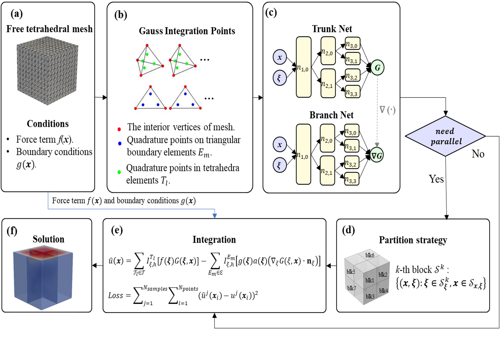

# GreensONet
This repository provides the code and data for following research papers:  
Jianghang Gu, Ling Wen, Yuntian Chen, and Shiyi Chen, An explainable operator approximation framework under the guideline of Green's function.


# Framework
The framework of GreensONet:

(a) Import user-defined free tetrahedral mesh and user-defined physical conditions;

(b) Calculate the locations of Gauss integration points and integration weights; 

(c) Constructions of the Trunk Net and Branch Net of the GreensONet based on binary structured neural networks; 

(d) Domain partition and parallel computation strategy; 

(e) Volterra integration based on acquired Green's function; 

(f) The calculated solutions. 




# Installation
```
conda create -n GreensONet python=3.10 # Create a Python 3 virtual environment with conda.
conda activate GreensONet # Activate the virtual environment
pip install torch
pip install meshio
```


# Run
 ```
 cd baseline/stokes/GreenONet
 python main.py
 ```


# Reference

(1) https://github.com/hangjianggu/Discover_Green_function/tree/main

(2) https://github.com/sloooWTYK/GF-Net/tree/main

(3) https://greenlearning.readthedocs.io/en/latest/guide/installation.html
